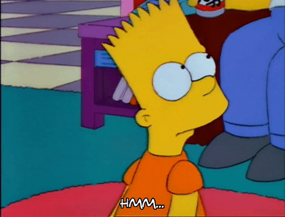

<!-- HEADER -->

  <h1>Week 05: Workshop Assignment - Number Guessing Game</h1>
  

    
  

   

<!-- /HEADER -->
<!-- MAIN -->

  <h2>The Instructions</h2>
  
 
    
  

 
<h2 align="center">The Solution(s)</h2>
<ul>
  <li>
    

      <h3><a href="./solution1/guessing_game.py">Solution #1</a></h3>
      
I followed the directives precisely as they were provided. All base and bonus tasks are satisfied.

    

  </li>
</ul>
 

<!-- /MAIN -->
<!-- FOOTER -->

  
Feel free to contact me if you have any questions, comments, or concerns.

  
    
  
  
    
   
  
    
  
   
   
  <blockquote>
    Be not simply good; be good for something. -Henry David Thoreau, <em>Letters to H.G.O. Blake</em>
  </blockquote>

<!-- /FOOTER -->
