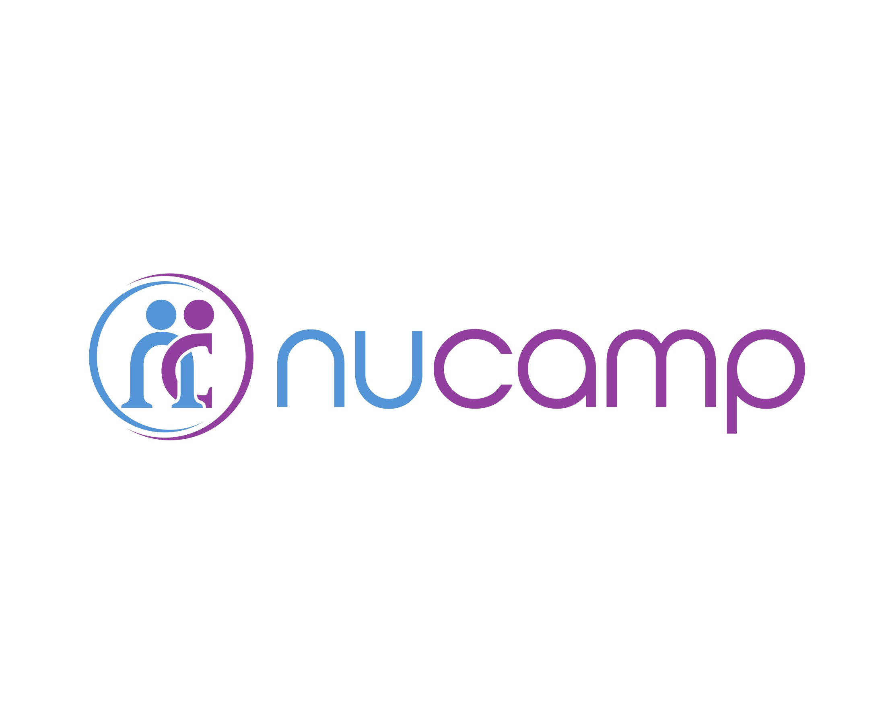

<!-- HEADER -->

  

    
  

   
  
This is a repository for the assignments, projects, and experimentation that pertain to the <a href="https://www.nucamp.co/bootcamp-overview/back-end-sql-devops-python" target="_blank">Python Developer bootcamp</a> via Nucamp.

<!-- /HEADER -->
<!-- MAIN -->
<h2>Assignments</h2>
<ul>
  <li>
    
Week 01: <a href="./1-Fundamentals/assignments/wk01" target="_blank">Fantasy Battle Game</a>

  </li>
  <li>
    
Week 02: <a href="./1-Fundamentals/assignments/wk02" target="_blank">ATM Application</a>

  </li>
  <li>
    
Week 03: <a href="./1-Fundamentals/assignments/wk03" target="_blank">Text-Based Donations Website</a>

  </li>
  <li>
    
Week 04: <a href="./1-Fundamentals/assignments/wk04" target="_blank">OOP Banking App</a>

  </li>
  <li>
    
Week 05: <a href="./1-Fundamentals/assignments/wk05" target="_blank">Number Guessing Game</a>

  </li>
</ul>
 
<h2>Projects</h2>
 

<!-- /MAIN -->
<!-- FOOTER -->

  
Feel free to contact me if you have any questions, comments, or concerns.

  
    
  
  
    
   
  
    
  
   
   
  <blockquote>
    Be not simply good; be good for something. -Henry David Thoreau, <em>Letters to H.G.O. Blake</em>
  </blockquote>

<!-- /FOOTER -->
